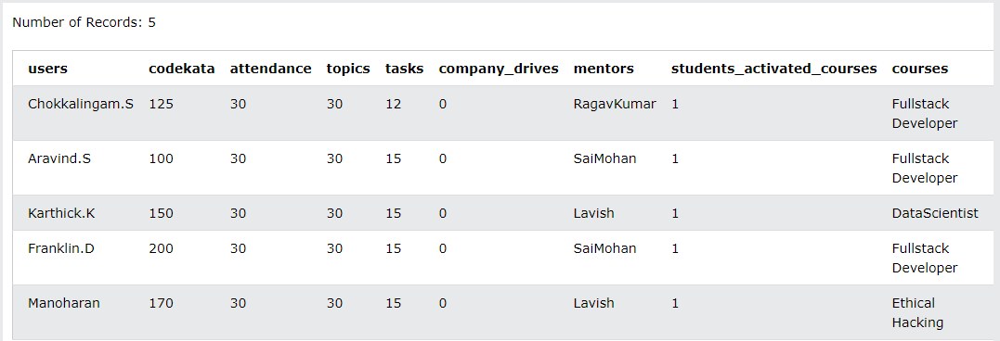
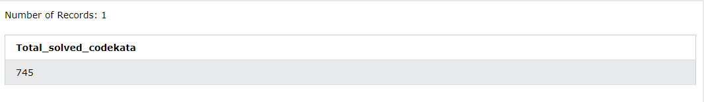
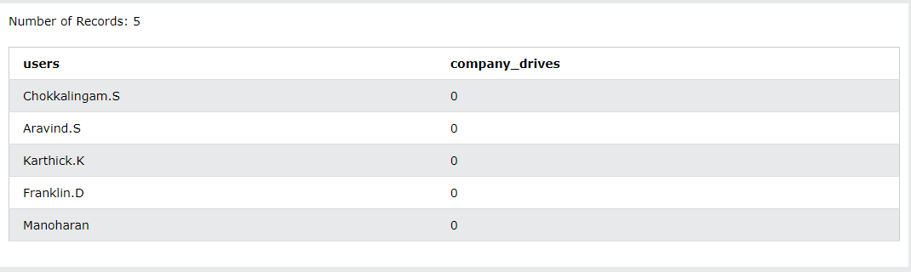
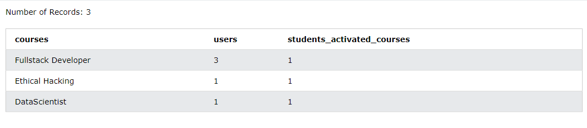
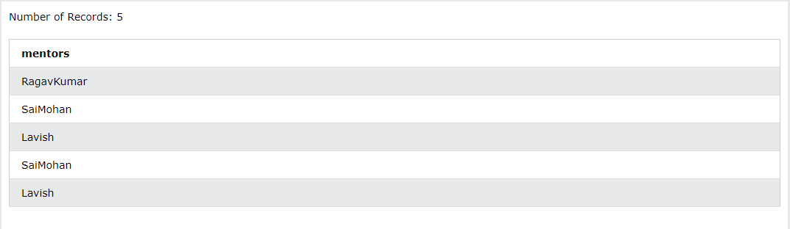
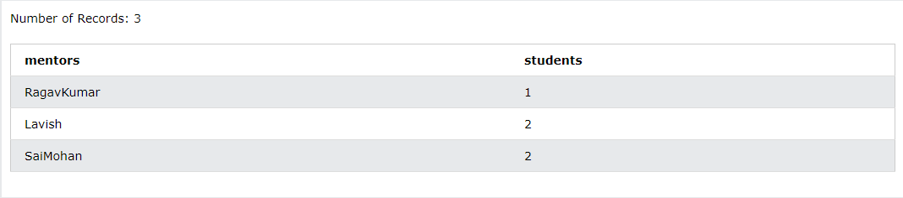

# SQL-Task-1

The Following are the tables has to be in your database & model deisgn:
users
codekata
attendance
topics
tasks
company_drives
mentors
students_activated_courses
courses

1. Create tables for the above list given
Ans:
CREATE TABLE Data(users  varchar(45),codekata integer,attendance integer,topics integer,tasks integer,company_drives integer,mentors varchar(45),
students_activated_courses integer,courses varchar(45));

2. insert at least 5 rows of values in each table
Ans:
INSERT INTO Data
(users,codekata,attendance,topics,tasks,company_drives,mentors,students_activated_courses,courses)
VALUES ("Chokkalingam.S",50,30,30,12,0,"RagavKumar",1,"Fullstack Developer"),
("Aravind.S",100,30,30,15,0,"SaiMohan",1,"Fullstack Developer"),
("Karthick.K",150,30,30,15,0,"Lavish",1,"DataScientist"),
("Franklin.D",200,30,30,15,0,"SaiMohan",1,"Fullstack Developer"),
("Manoharan",170,30,30,15,0,"Lavish",1,"Ethical Hacking");

</img>

3. get number problems solved in codekata by combining the users
Ans:
SELECT sum(codekata) as Total_solved_codekata FROM data

</img>

4.display the no of company drives attended by a user
Ans:
SELECT users,company_drives FROM data

</img>

5. combine and display students_activated_courses and courses for a specific user groping them based on the course
Ans:
SELECT courses,count(courses) as users,students_activated_courses FROM data GROUP BY courses ORDER BY courses desc

</img>

6. list all the mentors
Ans:
SELECT mentors FROM data

</img>

7.list the number of students that are assigned for a mentor
Ans:
SELECT mentors,count(users) as students FROM data GROUP BY mentors ORDER BY students

</img>

